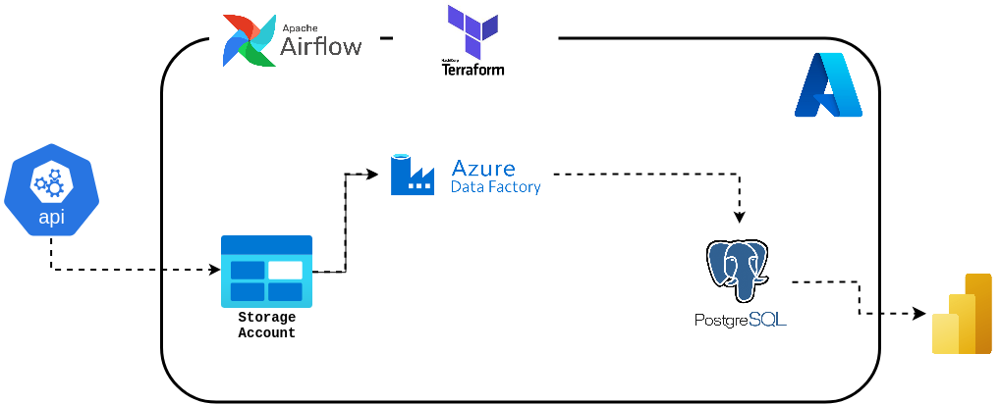

# 🏙️ CivicPulse: Urban City Service Requests Data Engineering Pipeline

[](https://azure.microsoft.com/)
[](https://airflow.apache.org/)
[](https://www.astronomer.io/)
[](https://www.terraform.io/)
[](https://www.postgresql.org/)
[](https://pola.rs/)
[](https://www.python.org/)
[](https://powerbi.microsoft.com/)

An enterprise-grade, end-to-end cloud data pipeline designed to ingest, process, transform, and serve municipal **311 Urban Service Requests** (such as NYC 311). This project empowers city planners, municipal authorities, and data teams with automated data movement, medallion lakehouse architecture, relational data warehousing, and interactive business intelligence reporting.

---

## 🌟 Overview & Business Context

Municipal 311 services provide residents with an official channel to report non-emergency civic concerns, ranging from residential noise and blocked sidewalks to illegal fireworks, heating complaints, and infrastructure hazards.

**Challenges addressed by this project:**
- **High-Volume Data Ingestion**: Handling hundreds of thousands of municipal records efficiently without hitting memory constraints.
- **Data Quality & Standardization**: Cleansing irregular schemas, standardizing datetime fields, mapping legacy complaint categories, and handling spatial coordinates.
- **Reliable Cloud Infrastructure**: Provisioning repeatable cloud environments using Terraform.
- **Automated Workflow Orchestration**: Coordinating multi-technology data jobs (Blob Storage, Polars, PostgreSQL, Azure Data Factory) with retries, logging, and scheduling in Apache Airflow.
- **Downstream Analytical Readiness**: Delivering high-performance analytical datasets directly into Azure Database for PostgreSQL for consumption by Power BI dashboards.

---

## 🏗️ Pipeline Architecture

The end-to-end data pipeline integrates cloud storage, high-throughput in-memory data processing, cloud orchestrators, managed databases, and analytics tooling:



### High-Level Workflow:
```text
┌─────────────────────────┐
│ Raw 311 Service Records │ (Source Data / Local CSV)
└────────────┬────────────┘
             │  Task 1: extract_data_from_api (Azure Blob Client)
             ▼
┌─────────────────────────┐
│ Azure Blob: Bronze Tier │ (Raw CSV Container)
└────────────┬────────────┘
             │  Task 2: transform_data (Polars Lazy Evaluation & Snappy Parquet)
             ▼
┌─────────────────────────┐
│ Azure Blob: Silver Tier │ (Cleaned, Projected Columnar Parquet)
└────────────┬────────────┘
             │  Task 3: create_db_table (Airflow SQLExecuteQueryOperator)
             ▼
┌─────────────────────────┐
│ Azure PostgreSQL (Gold) │ (Creates Schema 'gold' and Table 'urban_city_requests')
└────────────┬────────────┘
             │  Task 4: run_data_factory (AzureDataFactoryRunPipelineOperator)
             ▼
┌─────────────────────────┐
│ Azure Data Factory (ADF)│ (Batch Copy: Parquet to PostgreSQL Gold Table)
└────────────┬────────────┘
             │
             ▼
┌─────────────────────────┐
│  Power BI Analytics     │ (Spatial, Temporal & Trend Visualizations)
└─────────────────────────┘
```

---

## 🥇 Medallion Architecture

The project employs the **Medallion Architecture** pattern to guarantee data quality and isolation:

| Layer | Storage Target | Format | Description |
|---|---|---|---|
| **Bronze (Raw)** | Azure Blob Storage (`bronze`) | `.csv` | Untouched, source-fidelity raw data loaded directly from external data providers/APIs. |
| **Silver (Cleansed)** | Azure Blob Storage (`silver`) | `.parquet` (Snappy) | Cleaned, normalized, and schema-standardized columnar data generated via lazy-evaluated Polars transforms. |
| **Gold (Curated / Serving)** | Azure Database for PostgreSQL Flexible Server | Relational Table (`gold.urban_city_requests`) | Optimized analytical schema indexed for low-latency queries, aggregation, and direct BI dashboard integration. |

---

## 🛠️ Tech Stack

- **Cloud Platform**: [Microsoft Azure](https://azure.microsoft.com/)
  - **Azure Resource Group**: `urban-city-services-rg` (South Africa North)
  - **Azure Blob Storage**: `urbancityservicesstorage` (Hierarchical bronze/silver containers, GRS replication)
  - **Azure Database for PostgreSQL**: Flexible Server (v16, `GP_Standard_D4_v3`, P30 storage tier)
  - **Azure Data Factory (ADF)**: `urbancityservicefactory` (Serverless ETL pipelines, linked services, and Parquet datasets)
- **Infrastructure as Code (IaC)**: [HashiCorp Terraform](https://www.terraform.io/) (v5.0 AzureRM provider)
- **Workflow Orchestrator**: [Apache Airflow](https://airflow.apache.org/) via [Astronomer Astro Runtime](https://www.astronomer.io/) (v3.3-2, TaskFlow API)
- **Data Transformation Engine**: [Polars](https://pola.rs/) (`1.41.2`) — high-performance DataFrame library utilizing multi-threaded lazy execution (`scan_csv` / `sink_parquet`)
- **Programming Language**: Python 3.10+
- **Containerization**: Docker & Docker Compose
- **Data Visualization**: Microsoft Power BI Desktop / Service

---

## 📁 Repository Structure

```plaintext
civic_pulse_urban_city/
├── .astro/                           # Astronomer project metadata and local runtime state
├── .dockerignore                     # Docker build exclusion rules
├── .env                              # Environment variables (Azure keys, secrets - gitignored)
├── .gitignore                        # Git exclusion rules for secrets, venv, and large data
├── Dockerfile                        # Astro runtime container configuration (astrocrpublic.azurecr.io/runtime:3.3-2)
├── README.md                         # Comprehensive project documentation
├── airflow_settings.yaml             # Astro local connection, pool, and variable configurations
├── credentials.sh                    # Shell script to export Azure storage credentials for local runs
├── docker-compose.override.yml       # Docker Compose override for container networking and custom DNS
├── packages.txt                      # OS-level Debian packages required inside Airflow containers
├── requirements.txt                  # Python dependencies (Polars, Azure SDK, Airflow providers)
│
├── dags/                             # Airflow Directed Acyclic Graphs (DAGs)
│   ├── exampledag.py                 # Reference Astronauts dynamic task mapping sample DAG
│   ├── urban_city.py                 # Core production DAG: 'urban_city_requests'
│   └── sql/
│       └── urban_city.sql            # DDL script creating 'gold.urban_city_requests' table in PostgreSQL
│
├── data/                             # Data directory
│   └── 311_urban_service_requests.csv # Raw NYC 311 service request dataset (~300MB, 330k+ records)
│
├── img/                              # Architectural diagrams and documentation visuals
│   └── pipeline_architecture.drawio.png # Visual system architecture
│
├── include/                          # Reusable modules and ETL logic executed by Airflow tasks
│   ├── transform.py                  # Polars transformation pipeline (Bronze CSV -> Silver Parquet)
│   └── upload_raw_data.py            # Azure Blob client upload logic (Local/API -> Bronze Container)
│
├── plugins/                          # Custom Airflow plugins (extensible)
│
├── terraform/                        # Infrastructure as Code (Azure resource provisioning)
│   ├── credentials.txt               # Azure Subscription ID configuration (gitignored)
│   ├── main.tf                       # Terraform configuration (RG, Storage, PostgreSQL, ADF)
│   ├── variables.tf                  # Variable declarations (credentials, usernames, passwords)
│   └── variables.tfvars              # Variable values definition (gitignored)
│
└── tests/                            # Automated unit and pipeline tests
```

---

## 📊 Data Schema & Transformation

### 1. Raw Source Attributes
The source dataset (`311_urban_service_requests.csv`) includes over 40 attributes capturing incident identifiers, agencies, timestamps, complaint descriptions, and spatial coordinates.

### 2. Transformation Logic (`include/transform.py`)
To ensure high processing speed on large datasets without loading hundreds of megabytes into memory at once, the pipeline utilizes **Polars LazyFrames**:
```python
df = pl.scan_csv(source_uri, storage_options=storage_options)
df_refined = df.select([pl.col(old).alias(new) for old, new in column_mapping.items()])
df_refined.sink_parquet(target_uri, storage_options=storage_options, compression="snappy")
```

### 3. Serving Schema (`gold.urban_city_requests`)
The PostgreSQL database table defined in `dags/sql/urban_city.sql` maintains the curated analytical schema:

| Column Name | SQL Data Type | Source Field Equivalent | Description |
|---|---|---|---|
| `created_date` | `TIMESTAMP` | `Created Date` | Timestamp when the 311 request was submitted |
| `closed_date` | `TIMESTAMP` | `Closed Date` | Timestamp when the request was officially closed |
| `problem` | `TEXT` | `Problem (formerly Complaint Type)` | High-level complaint category (e.g., Noise, Illegal Parking) |
| `problem_detail` | `TEXT` | `Problem Detail (formerly Descriptor)` | Specific incident detail (e.g., Loud Music/Party, Blocked Hydrant) |
| `location_type` | `VARCHAR(100)` | `Location Type` | Premise type (Residential Building, Street/Sidewalk, Store) |
| `incident_adress`| `TEXT` | `Incident Address` | Street address where incident occurred |
| `city` | `VARCHAR(100)` | `City` | Municipal locality (e.g., New York, Queens Village, Woodhaven) |
| `borough` | `VARCHAR(100)` | `Borough` | Administrative borough (Manhattan, Bronx, Brooklyn, Queens, Staten Island) |
| `latitude` | `DOUBLE PRECISION` | `Latitude` | WGS84 geographic latitude coordinate |
| `longitude` | `DOUBLE PRECISION` | `Longitude` | WGS84 geographic longitude coordinate |

---

## ⚙️ Infrastructure as Code (Terraform)

All Azure resources are defined in declarative Terraform files inside `terraform/`.

### Resources Managed:
1. **Azure Resource Group**: `azurerm_resource_group.urban_city_services_rg`
2. **Azure Storage Account & Containers**:
   - Storage Account: `urbancityservicesstorage` (GRS replication, Standard tier)
   - Containers: `bronze` and `silver`
3. **Azure Database for PostgreSQL Flexible Server**:
   - Instance: `urbancityservicepgserver` (PostgreSQL 16, General Purpose D4 v3, 32 GB storage)
   - Database: `urban_city_service_db`
4. **Azure Data Factory**:
   - Service: `urbancityservicefactory`
   - Linked Service (Blob Storage): `blob_storage_ls`
   - Linked Service (PostgreSQL): `urban_city_service_postgresls`
   - Dataset: `urban_city_service_parquet_ds` (configured for Snappy-compressed Parquet in `silver`)

### Terraform Commands:
```bash
cd terraform

# Initialize providers and remote state
terraform init

# Validate configuration syntax
terraform validate

# Review proposed changes against variables.tfvars
terraform plan -var-file="variables.tfvars"

# Apply and provision infrastructure
terraform apply -var-file="variables.tfvars" -auto-approve

# Tear down all cloud resources when finished
terraform destroy -var-file="variables.tfvars"
```

---

## 🚀 Airflow Orchestration

The pipeline is orchestrated via the DAG `urban_city_requests` in `dags/urban_city.py`:

```python
extract_data_from_api() >> transform_data() >> create_db_table >> data_factory
```

### DAG Tasks Breakdown:
1. **`extract_data_from_api`**:
   - Executes `include/upload_raw_data.py`.
   - Uses `azure-storage-blob` to upload local or API-streamed CSV files directly into the Azure `bronze` container.
2. **`transform_data`**:
   - Executes `include/transform.py`.
   - Reads `az://bronze/311_urban_service_requests.csv` via Polars, cleanses column names, selects analytical columns, and streams the output directly to `az://silver/311_urban_service_requests.parquet`.
3. **`urban_city_table` (`SQLExecuteQueryOperator`)**:
   - Connects to Azure PostgreSQL using the `postgres_conn` connection ID.
   - Executes `dags/sql/urban_city.sql` to ensure the `gold` schema and target table exist before data loading.
4. **`run_data_factory` (`AzureDataFactoryRunPipelineOperator`)**:
   - Connects to Azure Data Factory using `azure_factory`.
   - Triggers the ADF pipeline `UrbanCityDataFactoryPipeline` to load Parquet files from `silver` into PostgreSQL `gold.urban_city_requests`.

---

## 💻 Getting Started & Local Setup

### Prerequisites
- **Python**: 3.10 or higher
- **Docker & Docker Compose**: Installed and running
- **Astronomer Astro CLI**: [Install Astro CLI](https://www.astronomer.io/docs/astro/cli/install-cli)
- **Terraform**: v1.5+ [Install Terraform](https://developer.hashicorp.com/terraform/install)
- **Azure CLI**: [Install Azure CLI](https://learn.microsoft.com/en-us/cli/azure/install-azure-cli)

### Environment Configuration

Create a `.env` file in the root of the project with your Azure credentials:
```env
ACCOUNT_KEY="<your_azure_storage_account_key>"
ACCOUNT_NAME="urbancityservicesstorage"
AZURE_TENANT_ID="<your_tenant_id>"
AZURE_CLIENT_ID="<your_service_principal_client_id>"
AZURE_CLIENT_SECRET="<your_service_principal_secret>"
AZURE_SUBSCRIPTION_ID="<your_subscription_id>"
```

For Terraform, create `terraform/credentials.txt` and `terraform/variables.tfvars`:
```bash
# terraform/credentials.txt
<your-azure-subscription-id>

# terraform/variables.tfvars
pg_password = "YourSecurePostgresPassword123!"
```

### Spinning Up Infrastructure
```bash
# Log in to Azure
az login

# Deploy infrastructure via Terraform
cd terraform
terraform init
terraform apply -var-file="variables.tfvars"
cd ..
```

### Starting the Airflow Environment
The project is built on the Astronomer runtime. Start the local Airflow environment with:

```bash
# Start Astro Airflow containers
astro dev start
```

Once started, access the Airflow Web UI at:
- **URL**: [http://localhost:8080](http://localhost:8080)
- **Default Username**: `admin`
- **Default Password**: `admin`

To stop or restart the environment:
```bash
# Restart with code/config updates
astro dev restart

# Stop all running containers
astro dev stop
```

### Configuring Airflow Connections
In the Airflow UI (**Admin** > **Connections**) or via `airflow_settings.yaml`, configure:

1. **`postgres_conn`** (Azure Database for PostgreSQL):
   - **Connection Type**: `Postgres`
   - **Host**: `<your-server-name>.postgres.database.azure.com`
   - **Database**: `urban_city_service_db`
   - **Login**: `adminadmin`
   - **Password**: `<your-postgres-password>`
   - **Port**: `5432`
   - **Extra**: `{"sslmode": "require"}`

2. **`azure_factory`** (Azure Data Factory):
   - **Connection Type**: `Azure Data Factory`
   - **Client ID**: `<your-azure-client-id>`
   - **Secret**: `<your-azure-client-secret>`
   - **Tenant ID**: `<your-azure-tenant-id>`
   - **Subscription ID**: `<your-azure-subscription-id>`
   - **Resource Group Name**: `urban-city-services-rg`
   - **Factory Name**: `urbancityservicefactory`

